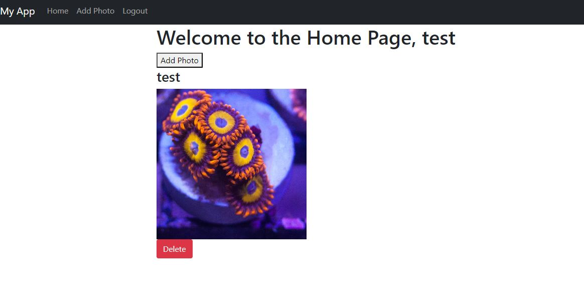
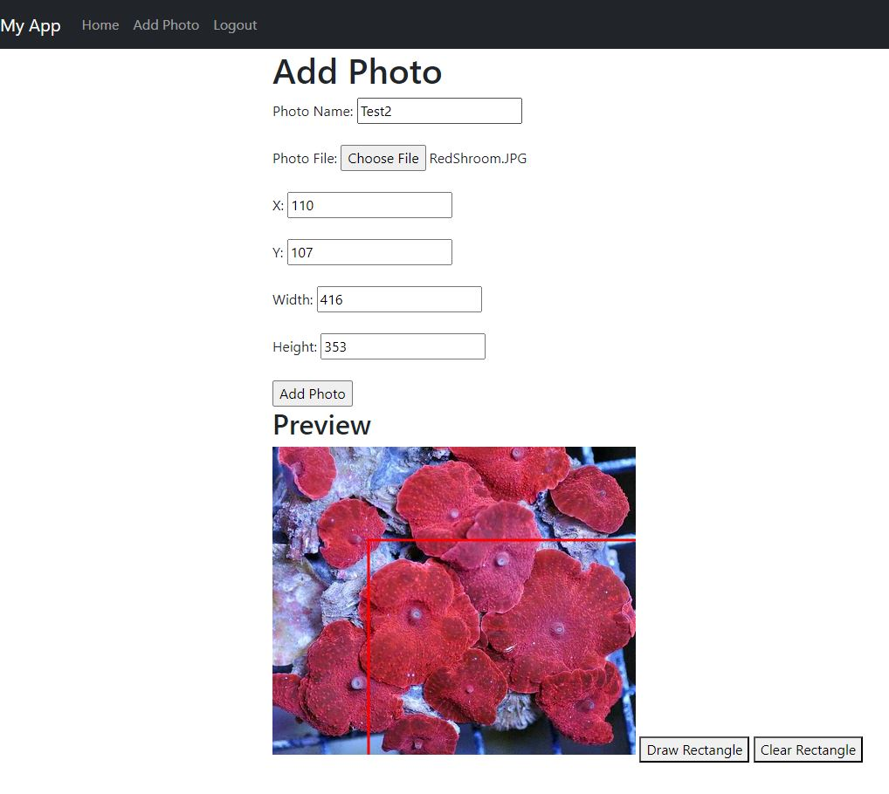

#User Images

This is a Flask project designed to practice working with Flask, PostgreSQL, MongoDB, Docker, and OpenCV.

The application allows users to create an account and, upon logging in, they can upload images and clip them using a predefined rectangle.

